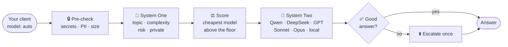

<div align="center">

# 🧭 system-one-router

**Fast thinking picks the model. Slow thinking answers.**

An OpenAI- and Anthropic-compatible gateway where a tiny, cheap "System One" decision model picks
the right "System Two" LLM for every prompt: the cheapest one that is good enough.

[](https://github.com/mmornati/system-one-router/actions/workflows/ci.yml)
[](https://mmornati.github.io/system-one-router/)
[](go.mod)
[](LICENSE)

[Getting started](docs/getting-started.md) ·
[How it works](docs/how-it-works.md) ·
[Claude Code & MCP](docs/claude-code-mcp.md) ·
[Benchmark](docs/benchmark.md) ·
[All docs](docs/README.md)

</div>

---

Send `model: "auto"`. A decision model ([Jev](https://openrouter.ai/docs/guides/community/jev) on OpenRouter, or
[Laya](https://huggingface.co/convaiinnovations/laya) running locally) answers four typed questions about the prompt
in one call: **topic, complexity, risk, private data**. Plain arithmetic over `config.yaml` then picks the cheapest
model that clears the quality floor. No LLM-as-router prompt, no guesswork.



## ✨ Highlights

<table>
<tr>
<td width="50%" valign="top">

**💸 Pays for what the prompt needs**<br/>
"hi" goes to a flash model, a multi-region failover design goes to Opus. Load penalties and daily budgets are part
of the cost estimate.

</td>
<td width="50%" valign="top">

**🔌 Drop-in for your tools**<br/>
`/v1/chat/completions` and `/v1/messages`: OpenAI SDKs, OpenCode and **Claude Code** work unchanged. There is also
an [MCP server](docs/claude-code-mcp.md#as-an-mcp-server) with `route` / `delegate` / `feedback` tools.

</td>
</tr>
<tr>
<td valign="top">

**🔒 Private stays local**<br/>
Secrets and PII are caught before anything leaves the machine. With `private: local_only`, private requests only
go to local models, or they are refused.

</td>
<td valign="top">

**✅ Checks its own work**<br/>
Optional [check-and-escalate](docs/check-and-escalate.md): one yes/no call judges the answer and re-sends a weak
one to a stronger model.

</td>
</tr>
<tr>
<td valign="top">

**🔁 Learns from outcomes**<br/>
Every decision, check and rating is logged. [`cmd/refit`](docs/refit.md) re-fits model skills from that data,
compared against peers at the same difficulty.

</td>
<td valign="top">

**📊 See where the money goes**<br/>
A built-in, dependency-free [dashboard](docs/observability.md): spend, savings, routing reasons, latency and
escalations per model.

</td>
</tr>
</table>

## 📏 By the numbers

80 labelled prompts, [Jev 1.13](docs/benchmark.md) as the decision model ([live report](https://mmornati.github.io/system-one-router/)):

| 🎯 Topic accuracy | 🛣️ Same route as human labels | 💰 Model cost vs always-Opus | ⚡ Decision latency | 🪙 Decision cost |
|:---:|:---:|:---:|:---:|:---:|
| **87%** | **73%** | **$1.37** vs $2.40 (−43%) | **366 ms** p50 | **$0.04** / 1k requests |

## 🚀 Quickstart

```bash
cp .env.example .env    # put your OpenRouter key in it
go run ./cmd/gateway    # listens on 127.0.0.1:8787
```

```bash
curl -s localhost:8787/v1/chat/completions -D - \
  -d '{"model":"auto","messages":[{"role":"user","content":"Design a multi-region Postgres failover"}]}'
# X-Router-Model / -Reason / -Topic / -Complexity / -Risk: what was picked, and why
```

Then point your tools at it:

```bash
OPENAI_BASE_URL=http://127.0.0.1:8787/v1                              # any OpenAI client, model "auto"
ANTHROPIC_BASE_URL=http://127.0.0.1:8787 ANTHROPIC_AUTH_TOKEN=dummy \
ANTHROPIC_MODEL=auto ANTHROPIC_SMALL_FAST_MODEL=auto claude           # Claude Code
```

More in [Getting started](docs/getting-started.md).

## 📊 Dashboard

<div align="center">
<a href="docs/observability.md"></a>
</div>

## 📚 Documentation

| | |
|---|---|
| 🚀 [Getting started](docs/getting-started.md) | Install, run, connect clients |
| 🧠 [How it works](docs/how-it-works.md) | Pipeline, scoring, decision providers |
| ⚙️ [Configuration](docs/configuration.md) | Every `config.yaml` key |
| 🔌 [HTTP API](docs/api.md) | Endpoints, `X-Router-*` headers, feedback |
| 🅰️ [Anthropic Messages API](docs/anthropic-messages.md) | `/v1/messages` details |
| 🤖 [Claude Code & MCP](docs/claude-code-mcp.md) | Provider mode and MCP server |
| ✅ [Check and escalate](docs/check-and-escalate.md) | Answer check and escalation |
| 📊 [Dashboard & event log](docs/observability.md) | `/dashboard`, `decisions.jsonl` |
| 🔁 [Re-fitting skills](docs/refit.md) | Learn skills from outcomes |
| 📏 [Benchmark](docs/benchmark.md) | Jev vs Laya, full results |
| 🦙 [Laya sidecar](docs/laya-sidecar.md) | Local decision model |
| 🏗️ [Architecture](docs/architecture.md) | Code layout, make targets |
| 🗺️ [Roadmap](docs/roadmap.md) | Done and next |

## 🙏 Credits & license

Successor of [ai-dispatch](https://github.com/mmornati/ai-dispatch).

Apache-2.0. Laya weights are Apache-2.0 ([Convai Innovations](https://huggingface.co/convaiinnovations/laya));
Jev is a hosted TypeSafe model used through OpenRouter.
