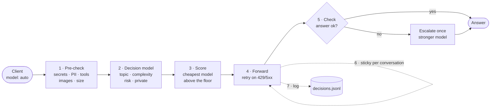

# How it works

[← Docs index](README.md)

A fast "System One" decision model ([Jev](https://openrouter.ai/docs/guides/community/jev) or a local
[Laya](https://huggingface.co/convaiinnovations/laya)) decides which "System Two" LLM should answer each prompt.
The expensive thinking is left to the model that is picked. The decision itself is cheap, typed, and happens in a
single call.

## The pipeline

Send `model: "auto"` and the gateway will:

1. **Pre-check** the request locally: secrets/PII regexes, tools, images, size.
2. **Ask a decision model**, [Jev](https://openrouter.ai/docs/guides/community/jev) on OpenRouter or a local
   Laya helper, four typed questions in one call: main topic (with probabilities), complexity 0–3, risk 0–2, and
   private data yes/no.
3. **Score the models** in `config.yaml`, with no LLM involved:
   - skill = Σ P(topic) × the model's affinity for that topic;
   - quality floor = `min_skill[complexity] + risk_bonus[risk]`, raised one level when the decision model's
     confidence is low;
   - the cheapest model that clears the floor wins; the cost estimate includes an in-flight load penalty and daily
     budgets.
4. **Forward** to the chosen model, streaming or not. On a 429 or 5xx it tries the next candidates, and on the
   chat endpoint it sets `reasoning.effort` from the complexity.
5. **Check the answer** (optional, non-streaming only): one yes/no question to the decision model, "does the answer
   fully and correctly address the request?". If not, the request goes once to a stronger model and the client gets
   that answer instead. See [Check and escalate](check-and-escalate.md).
6. **Keep the model** for the rest of the conversation. Switching models mid-conversation throws away the prompt
   cache.
7. **Log** every decision, check and piece of feedback to `data/decisions.jsonl`, for
   [re-fitting the skills](refit.md) in `config.yaml`.

Requests naming any other model are passed through unchanged.

## Decision providers

`decision.provider`:

- `jev`: always use Jev.
- `laya`: always use Laya.
- `auto`: use the local provider for requests the pre-check flags as private, Jev otherwise.

`private: local_only` never sends a private request off the machine; with no local option it answers 422.

`shadow: laya` asks a second provider in the background and logs whether it agrees. Use it to decide when Laya is
good enough.

Any local service that accepts `POST {model, state, questions}` and returns `{answers, usage}` works unchanged; see
the [Laya sidecar](laya-sidecar.md). Laya's English checkpoint sees only 512 tokens, so set `max_state_chars` to
about 1500.

## Exploration

A cheap model never sees prompts above its seed skill, so [refit](refit.md) can lower its skill but hardly raise
it. `routing.explore` (default 0, off) is the probability of sending a request to the next-cheaper capable model
just below the floor, instead of the cheapest model that clears it. This happens only for complexity ≤ 1, risk 0
and non-private requests, with reason `explore: …`. A value of 0.02–0.05 is enough to collect data. When combined
with [check-and-escalate](check-and-escalate.md), a poor exploratory answer is escalated anyway.
