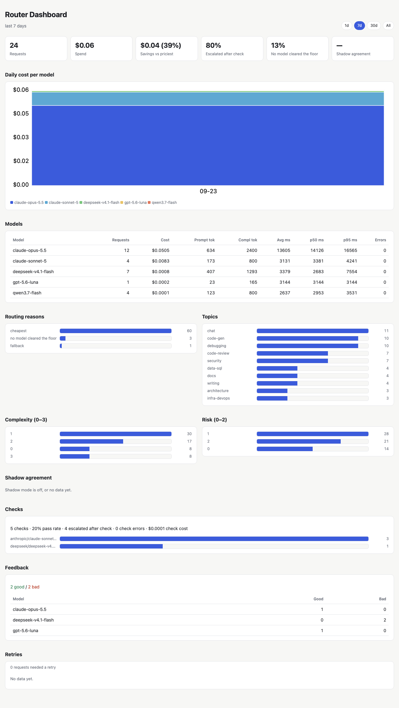

# Dashboard & event log

[← Docs index](README.md)

## Dashboard

`GET /dashboard` is a single self-contained HTML page (no external JS) that fetches `/stats` and renders:

- tiles for requests, spend, savings and shadow agreement;
- "escalated after check" (share of checked answers re-sent to a stronger model) and "no model cleared the floor"
  (share of routed requests);
- a stacked daily cost-per-model chart;
- a per-model table (cost, tokens, latency percentiles, errors);
- routing-reason and topic/complexity/risk bars;
- shadow-agreement, check-escalation and feedback sections.

An escalated request counts once in the request totals, but both calls count in spend and in the per-model
numbers. A day selector (1 / 7 / 30 / all) re-fetches `/stats` with a different `days` value. It reads
`data/decisions.jsonl` each time it's called, so it always reflects the current log.

*Captured from a real run (2026-09-23, 18 requests, $0.10). Jev was slow during this run: 9 decisions hit the 3 s
`timeout` and went to `fallback_model` (Sonnet), which is why fallback dominates the routing reasons.*

## Event log

Every request to `/v1/chat/completions`, `/v1/messages` and `/route` gets a request id (12 random bytes, hex),
returned in `X-Router-Request-Id` and included in its logged events. Each line in `data/decisions.jsonl` is
`{"ts", "kind", "data"}`, where `kind` is one of:

| `kind` | Written when | `data` |
|---|---|---|
| `chat` | a request is forwarded | `id`, `decision` (the full routing `Decision`, `null` for a pass-through request naming a model directly), `model`, `failed` (models that errored before this one), `status`, `cost_usd`, `prompt_tokens`, `completion_tokens`, `reasoning_tokens`, `latency_ms` (upstream round trip), `stream`, and `api: "anthropic"` for `/v1/messages` requests (absent for chat completions). An escalated request logs a second `chat` event with the same id and `escalated_from`. |
| `check` | the [answer check](check-and-escalate.md) runs | `id`, `model` (the model checked), `p_ok`, `passed`, `escalated_to` (`""` if none), `check_cost_usd`, `check_ms`, `provider`; or `id`, `model`, `error` when the check call failed. |
| `route_dry` | `POST /route` is called | the `Decision` itself, including `id`. |
| `refused` | the routing policy refuses a request (private + `local_only`, no local model) | the `Decision`. |
| `shadow` | the background shadow provider answers (`decision.shadow` in config) | `id`, `provider`, `primary`/`shadow` signals, `agree_topic`, `agree_complexity`. |
| `feedback` | `POST /feedback` is called ([API](api.md#feedback)) | `id`, `rating`, `comment`. |

The `Decision` logged with `chat`, `route_dry` and `refused` carries `state`: the state map sent to the decision
model (`request`, `conversation_start`, `system_prompt`), kept as training data for re-fitting skills.

> [!IMPORTANT]
> **`state` is omitted whenever the request is flagged private** (local pre-check or the decision model's own
> `private_data` answer), so secrets never end up in the log twice. The log otherwise contains prompts and the
> responses' cost/token metadata, not the responses themselves.
